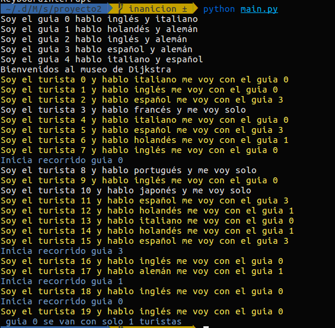
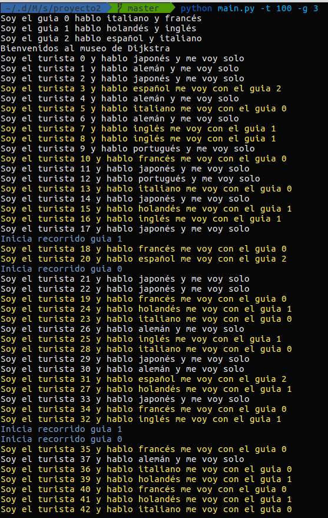
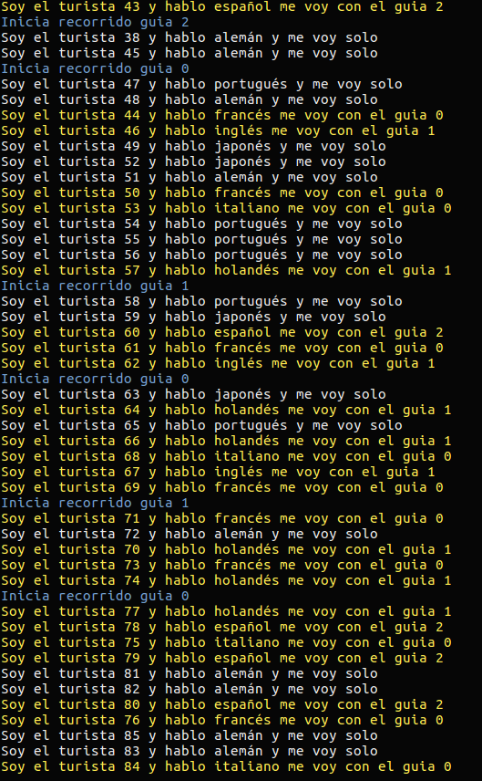
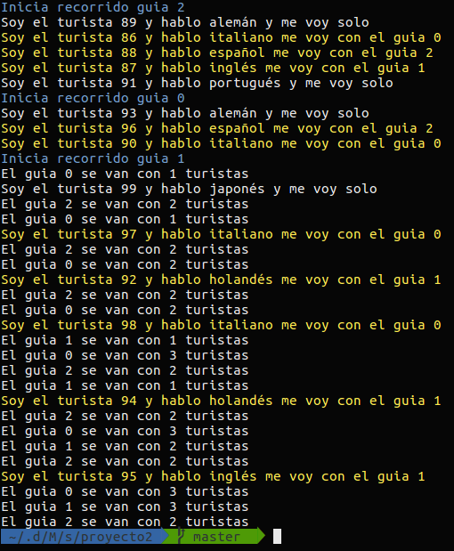

# El Museo de Djisktra

## Integrantes

* Francisco RODRIGO
* Sanchez BREATRIZ

## Identificación del problema

En la vida cotidiana se presentan situaciones de concurrencia para los cuales serían buena idea poder aplicar los métodos de sincronización vistos en clase. Para el caso del museo de Djisktra se tiene la siguiente problemática.

El museo cuenta con guías que solo pueden atender a turistas que hablan ciertos idiomas. La característica principal de nuestros guías es que:

* Un guía puede hablar como máximo **dos idiomas**, los cuales podrían ser: español, inglés, alemán, japonés, francés, portugués, italiano, holandés.

Para comenzar a dar el recorrido se deben cumplir ciertas condiciones

* contar por lo menos  con cuatro turistas a su cargo en caso de que haya los suficientes, es decir, que si al museo ya no llegan más turistas, el guía no tiene a quien esperar, por lo tanto debe comenzar su recorrido con menos de cuatro turistas.

* El guía debe dar el recorrido a  turistas que hablen el mismo idioma que el, no importando el número de turistas que haya de cada idioma.

* En caso de que el museo no cuente con guías que hablen el mismo idioma que el turista este debe comenzar su recorrido solo, y quejarse con el museo por el mal servicio.


  En el problema planteado se puede ver la concurrencia a la hora de llegada de los turistas y su asignación a cierto guía.

* Inicialmente se quiere controlar que los guías inicien su recorrido con solo 4 turistas, pero si no se cumple la condición al final de la llegada de todos los turistas(hilos) los guías deben seguir trabajando e irse a dar los recorridos.

* También se quiere controlar la manera en la que los turistas son asignados a los guías, ya que esto va a depender de los idiomas que hablen.

### Caso base

```shell
Guía 1 habla italiano y frances
Guía 2 habla español e inglés
Llegan 3 ingleses, 1 español, 1 italiano, 1 frances, 1 holandes
Guía 2 inicia su recorrido!
Guía 1 inicia su recorrido con 2 turistas, no hay más ):
Turista 7 se va solo
```

## Descripción de la solución

### Estructura del programa

Para la resolución del problema pensamos todo en términos de `clases`, creamos dos clases principales.

* La clase Guia.
* Y la clase Turista.

La clase guia se compone de

* Un `id`
* Una lista de idiomas debido a que el guia puede manejar 2 idiomas.
* Un contador de turistas que se van a ir con él

En la clase turista pusimos todos nuestros esfuerzos. Se compone de

* Un `id`
* Un idioma

Y por último tuvimos que definir variables globales como una

* lista de guías
* Un contador de turistas
* Y un par de variables que nos ayudan a las sincronización como
  * Una **lista** de mutex guía.
  * Una **lista** de semaforos para los turistas. En el código se encuentra como `lista_turistas`.
  * Y por último tenemos un simple mutex para proteger al contador.

### Mecanismos utilizados

El atributo contador de cada objeto de tipo Guia va a fungir como una región crítica, se utiliza una lista de mutexes para proteger la sección crítica de cada guía que se crea en el programa. Los mutex guia son una lista de mutexes en donde cada posición corresponde a un guía del museo, entonces si un turista intenta incrementar el contador su región crítica queda protegido el mutex correspondiente.

Crear listas de mutexes fue un importante porque tenemos validar que si el guía 2 habla inglés y francés y un turista `A` que habla francés quiere irse con el entonces lo que debe pasar es que el turista `A` pide la sección crítica correpondiente al guía 2.

Para resolver la condición en la cual un guía no se pude ir si no tiene 4 turistas tuvimos que hacer uso de una `barrera`. Los turistas se pueden ir a cualquier guía *n* que les corresponda de acuerdo a su idioma, una vez que ya saben que guía les va a dar el recorrido se duermen hasta que llega un cuarto turista, el cual es el encargado de despertarlos. Pero, ¡Cuidado! tiene que despertan solo a los turistas que se van con el guía n, no puede despertar a los turistas del $guía_{n+1}$ por lo cual tuvimos que jugar con las posiciones de los mutex y de nuestra `lista_turistas` para hacer que concordaran. En otras palabras si un guía *n* tenían 3 turistas y llega un 4° este despertará a los demás de la siguiente manera.

```python
for i in range(4)
	lista_turistas[n].release # en donde n es la posción del guía que ellos decidieron seguir con base en su idioma.
```

¡PERO! podría presentarse el caso desafortunado en el cual un turista habla idioma que ningún otro guía habla, ¿qué hacemos? Pues *no hay que complicarse la vida*, ni a nosotros ni al pobre turista. No debemos mandarlo con algún guía porque no le entenderá nada. La única vía es **mandarlo solo**.

**¿Qué falta considerar?**

¿Qué pasa si ya llegaron todos los turistas que tenían que llegar en un día habitual, es probable que los guías entren en anición debido a que no van a poder hacer su recorrido porque no tienen el número suficiente de turistas.

**Solución**

Podemos asumir que sabemos cuando llega el último turista, para eso usar la variable llamada `contador_turistas`, una vez ha llegado el último turista le delegamos la responsabilidad de avisar  a los otros grupos de guías y turistas que nadie más llegará al museo por lo cual ellos deben iniciar su recorrido a pesar de ser pocos (menos de cuatro para nuestra sencilla simulación.)

Admitimos que en esta parte de la solución perdimos un poco de elegancia porque el último turista despierta casi por "fuerza bruta" al resto de los turistas.

## Entorno y dependencias

El proyecto fue desarrollado en python 3.7.0, para la ejecución del programa usted va a ser el jefe del museo, va a poder elegir cuantos guías van a atender ese día, al igual que cuantos turistas podrán visitar el museo, esto si es que lo quiere, si no por defecto serán 5 guías y 20 turistas.

Se hace uso de algunas bibliotecas para la mejor visualización y manejo para el usuario, como usuario linux no es necesario instalar nada.

PARA LA EJECUCIÓN:

-Nos movemos a la carpeta donde se encuentra el archivo **main.py**, es decir:

sistop-2019-2/proyectos/2/FranciscoRodrigo-SanchezBeatriz/

Una vez dentro para la ejecución tenemos 3 banderas:

-h para ver la ayuda, básicamente nos va a mostrar las banderas que tenemos disponibles, ahí ya veremos las otras dos opciones que tenemos:

```powershell
$python main.py -h
usage: main.py [-h] [-t TURISTAS] [-g GUIAS]

Ayuda para el usuario

optional arguments:
  -h, --help            show this help message and exit
  -t TURISTAS, --turistas TURISTAS
                        Define el numero de turistas
  -g GUIAS, --guias GUIAS
                        Define el numero de guias
```

Ejemplo de salida de la ejecución.


Si no se ponen argumentos, los que trae por defecto son 20 turistas y 5 guías:



Por ejemplo, se quiere que un día en el museo vayan 100 turistas y  3 guías, se tendría que poner algo como lo siguiente:

```shell
$python main.py -t 100 -g 3
```








El programa fue probado en un sistema operativo linux, distribución ubuntu 16.
