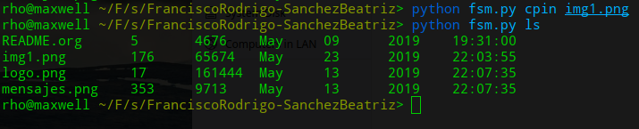
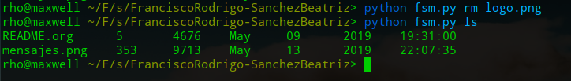

c

# Micro Sistema de Archivos

## Integrantes

 ```shell
Francisco Rodrigo
Sánchez Breatriz
 ```

Siguiendo la especificación que aparece en la siguiente sección, tienen que desarrollar un programa que pueda:

1. Listar los contenidos del directorios
2. Copiar uno de los archivos de dentro del `FiUnamFS` hacia tu sistema
3. Copiar un archivo de tu computadora hacia tu `FiUnamFS`
4. Eliminar un archivo del `FiUnamFS`
5. Desafortunadamente, este sistema de archivos *simplote* es muy dado a la fragmentación externa. Generen también un programa que *desfragmente* al `FiUnamFS`. Ojo, la defragmentación debe hacerse *dentro del sistema de archivos* (no creando un sistema de archivos nuevo y copiando hacia éste).

## ¿Cuáles son los contenidos del disco?

### README.org

#### metadatos

```shell
- nombre: README.org
- cluster inicial : 5
- Tamaño : 4676
- Fecha de creación:
- Fecha de modificación:
```

#### contenido

```markdown
#+title: Proyecto 3: (Micro) sistema de archivos

#+BEGIN_SRC yaml
Planteamiento: 09.05.2019
Entrega: 23.05.2019
#+END_SRC

** Descripción del proyecto

Para la unidad de sistemas de archivos, creo que resulta natural que
el proyecto sea implementar un sistema de archivos 😉 Pero, a
diferencia de lo que algunos de ustedes recordarán por iteraciones de
este curso, esta vez lo harán trabajando sobre una /especificación/ y
sobre un /caso de referencia/.

Ojo: Les planteo en este momento el proyecto. Déjenme pensar un poco
en un par de refinamientos que tengo pendientes, incluyendo desglosar
cómo será calificado. Toda esa información, sin falta, antes del
/martes 14 de mayo/.

.
.
.
```


### logo.png

#### metadatos

```shell
- nombre: logo.png
- cluster inicial : 17
- Tamaño : 161444
- Fecha de creación:
- Fecha de modificación:
```

#### contenido


### mensajes.png

#### metadatos

```shell
- nombre: mensajes.png
- cluster inicial : 353
- Tamaño : 9713
- Fecha de creación:
- Fecha de modificación:
```

#### contenido


## Descripción de la solución

LS:  Para este comando se leyeron los clusters del 1-4 y para cada uno que no tuviera la cadena 'AQUI NO VA NADA' se guararon los metadatos de cada archivo en un arreglo de objetos llamado DIRENTRY.


RM: Para borrar un archivo solo hay que perder la referencia a este archivo, en otras palabras sustituir el nombre del archivo por la cadena 'AQUI NO VA NADA'.


CPOUT: Busca si el archivo existe y si sí lo copia en el directorio donde se está ejecutando el programa.

CPIN: Se tomaron tres casos para esta función:

* Cuando el directorio está vacío, se copia la sección de datos del archivo al clúster 5, que es nuestro primer clúster en la sección de datos.

* Cuando solo hay un archivo, desfragmentamos, lo cúal hace que el unico archivo que se encuentra pase al primer clúster y de esta manera el archivo que copiemos se va aguardar donde termine este unico archivo.

  Hay varias maneras de implementar este caso pero creemos que esta es la más optima.

* Cuando hay más de un archivo, buscamos el primer espacio disponible para copiar nuestro nuevo archivo

  * Este algoritmo no esta del todo refinado, porque  en primera instancia no verifica si el espacio entre el último elemento y el final del "disco" este libre, es decir, no se puede ocupar el espacio marcado en amarillo canario en la figura.

    

  * Para solucionar este problema, utilizamos una vil bandera, lo cual no es muy elegante pero funciona :cry: (líneas 291-305)

## Entorno y dependencias

El proyecto fue desarrollado en Python 3.7.0, para comenzar a utilizar el sistema de archivos creado, tome en cuenta las opciones con las que se cuentan:

PARA LA EJECUCIÓN:

-Nos movemos a la carpeta donde se encuentra el archivo **fsm.py**, es decir:

sistop-2019-2/proyectos/3/FranciscoRodrigo-SanchezBeatriz/

Una vez dentro las opciones que tendremos para ejecutar son las siguientes:

`$python fsm.py ls`

Opción ls : nos va a listar el contenido del sistema FiUnamFS, los metadatos de los archivos que nos muestra son: nombre, cluster inicial, tamaño, fecha de modificacion.


`$python fsm.py cpin <nombre_archivo_externo>`

Opción cpin: Copia un archivo que tengamos en nuestra compuradora a nuestro sistem FiUnamFS, en este caso tenemos una imagen llamada : 'img1.png'



`$python fsm.py cpout <nombre_archivo_interno>`

Opción cpout: Copia un archivo que tengamos en nuestro sistema a nuestra computadora


`$python fsm.py defrag`

Opción cpin: Copia un archivo que tengamos en nuestra compuradora a nuestro sistem FiUnamFS, en este caso tenemos una imagen llamada : 'img1.png'


`$python fsm.py rm`

Opción rm: Elimina un archivo de nuestro sistema FIUnamFS


