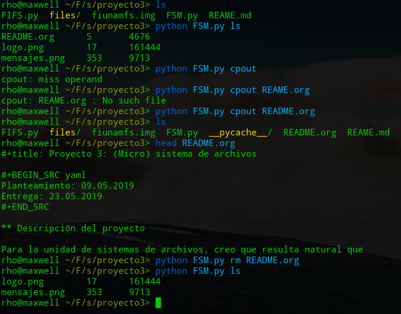

# Micro Sistema de Archivos

 ```shell
Francisco Rodrigo
Sánchez Breatriz
 ```

## Tareas a realizar

0. Lista directorios (Betty)
   1. Ya lo hice pero a medias, falta decir su fecha de modificación, etc.
      1. Para ello pues hay que crear una función que del formato de fecha que nos dio el profe  pasarlo a un formato entendible
1. Copiar archivos 1  (Yo)
   1. Solo falta que los puede copiar a "cualquier directorio"
2. Copiar archivos 2 (Yo)
   1. Se puede hacer pero solo para archivos pequeños, cuado se implemente **desfragmentar**  ya podremos copiar archivos más grandes a él.
3. Eliminar un archivo (Yo) [ Listo ] 
4. Desfragmentador (Betty)
5. Integración con FUSE (Yo)
6. Documentación (Betty)
   1. lista de los comandos que puede usar y cuales son sus parametros


## Captura de "comandos" exitosos



## ¿Cuáles son los contenidos del disco?

### README.org

#### metadatos

```shell
- nombre: README.org
- cluster inicial : 5
- Tamaño : 4676
- Fecha de creación:
- Fecha de modificación:
```

#### contenido

```markdown
#+title: Proyecto 3: (Micro) sistema de archivos

#+BEGIN_SRC yaml
Planteamiento: 09.05.2019
Entrega: 23.05.2019
#+END_SRC

** Descripción del proyecto

Para la unidad de sistemas de archivos, creo que resulta natural que
el proyecto sea implementar un sistema de archivos 😉 Pero, a
diferencia de lo que algunos de ustedes recordarán por iteraciones de
este curso, esta vez lo harán trabajando sobre una /especificación/ y
sobre un /caso de referencia/.

Ojo: Les planteo en este momento el proyecto. Déjenme pensar un poco
en un par de refinamientos que tengo pendientes, incluyendo desglosar
cómo será calificado. Toda esa información, sin falta, antes del
/martes 14 de mayo/.

.
.
.
```


### logo.png

#### metadatos

```shell
- nombre: logo.png
- cluster inicial : 17
- Tamaño : 161444
- Fecha de creación:
- Fecha de modificación:
```

#### contenido


### mensajes.png

#### metadatos

```shell
- nombre: mensajes.png
- cluster inicial : 353
- Tamaño : 9713
- Fecha de creación:
- Fecha de modificación:
```

#### contenido

