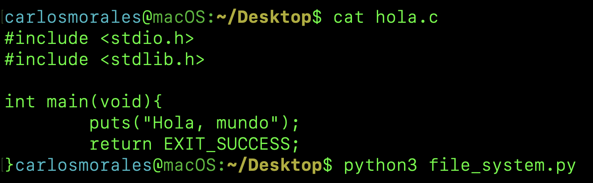
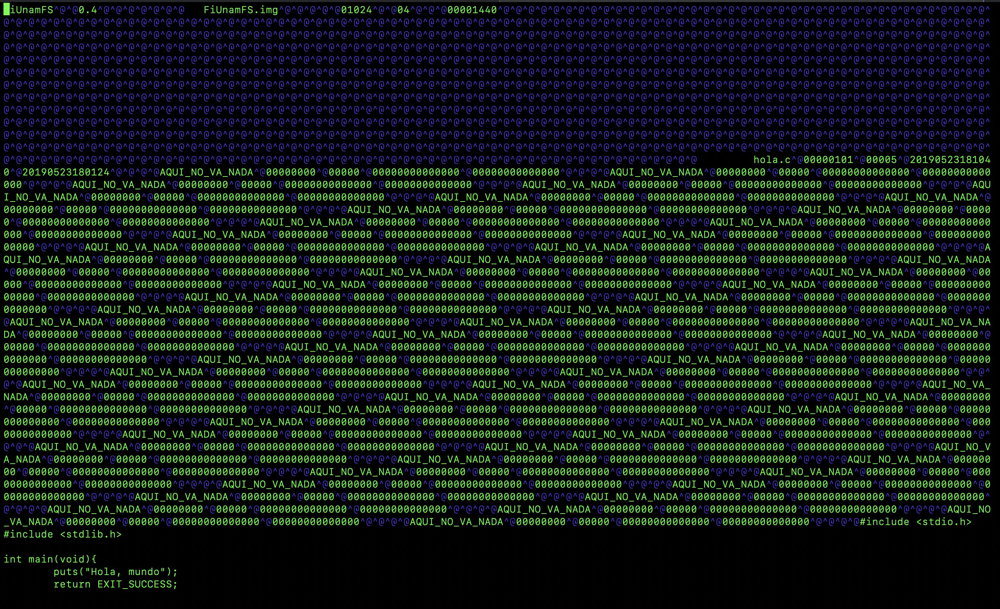
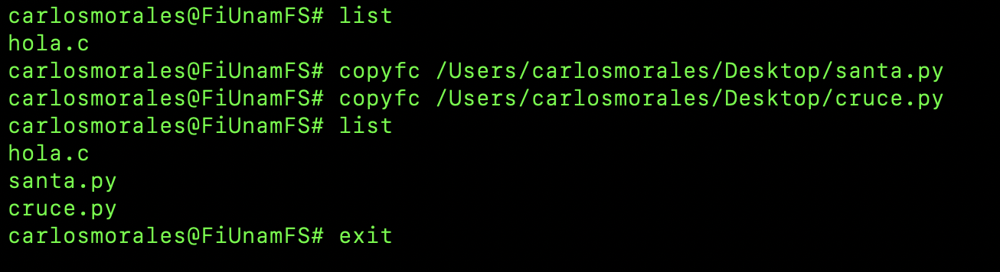
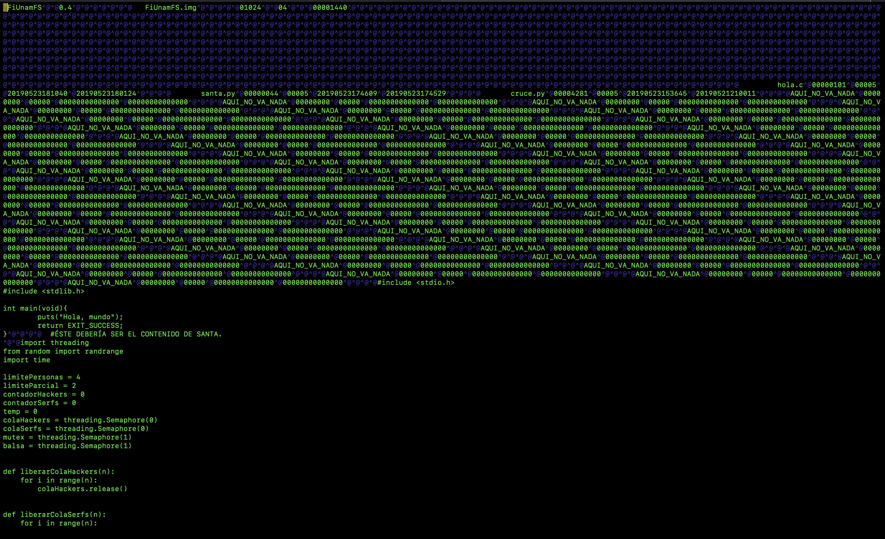
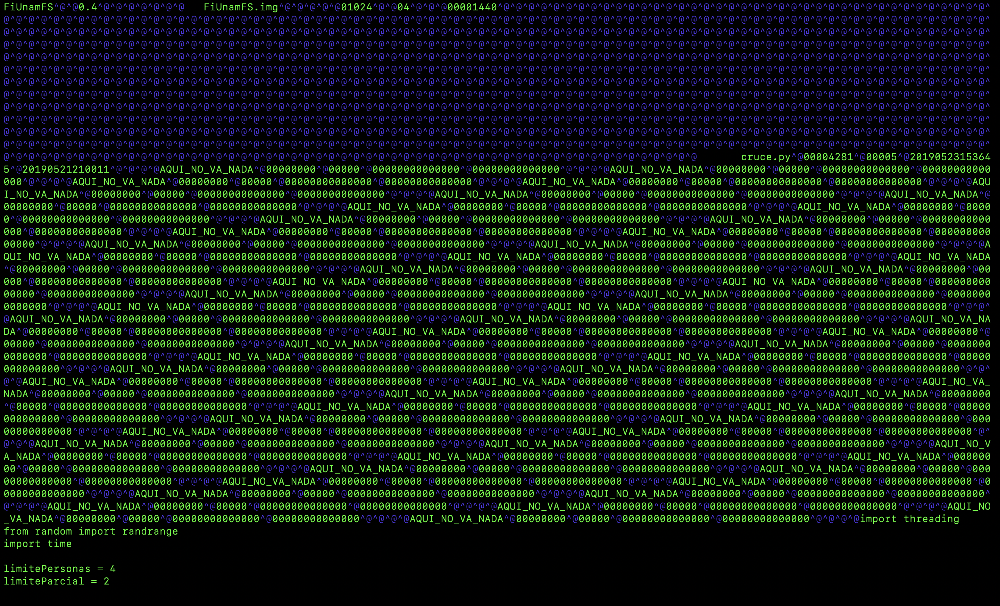
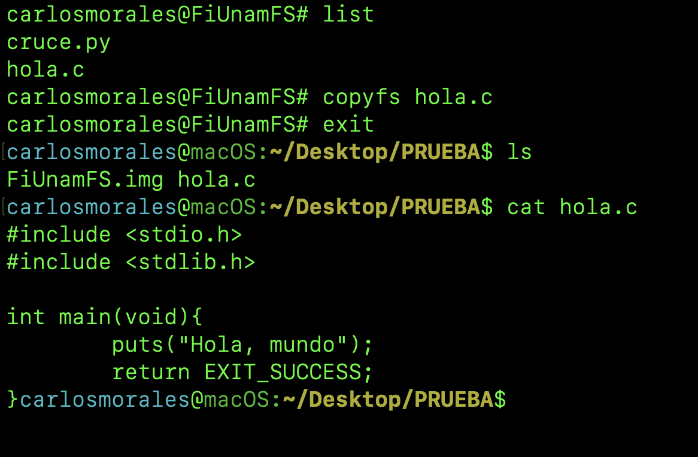

# FiUnamFS
Micro sistema de archivos
```
Morales Tellez Carlos Gamaliel
Pérez Quiroz Miguel Ángel
```

## Entorno de desarrollo
1. Lenguaje de programación: **python 3.7.2**
2. Bibliotecas utilizadas: **os, subprocess, time, datetime, math, getpass**
3. Desarrollado y probado en: **macOS 10.14.4** 
**NOTA:** Debería funcionar en entornos UNIX con python 3.7.2 instalado

## Introducción
FiUnamFS es un sistema de archivos plano que cabe en un diskette tradicional y queda representado en un archivo de longitud fija de 1440 Kilobytes llamado 'FiUnamFS.img'. 

### El superbloque
El superbloque está ubicado en el cluster 0 y contiene la siguiente información:
- 0--8 :: El nombre del sistema de archivos. **FiUnamFS**
- 10--13 :: Versión de la implementación. **0.4**
- 20--35 :: Etiqueta del volumen. **FiUnamFS.img**
- 40--45 :: Tamaño del cluster en bytes. **1024**
- 47--49 :: Número de clusters que mide el directorio. **64**
- 52--60 :: Número de clusters que mide la unidad completa. **1440**
El resto del superbloque está vacío.  

### El directorio
El directorio está ubicado en los clusters 1 a 4. Cada entrada ocupa 64 bytes y contiene la siguiente información:
- 0--15 :: Nombre del archivo
- 16--24 :: Tamaño del archivo, en bytes
- 25--30 :: Cluster inicial
- 31--45 :: Hora y fecha de creación del archivo en formato 'AAAAMMDDHHMMSS'  
- 46--60 :: Hora y fecha de modificación del archivo en formato 'AAAAMMDDHHMMSS'  
- 61--64 :: Espacio no utilizado

Todas las magnitudes que se almacenan en los primeros cinco clusters se almacenan como cadenas de numeros en decimal, no en binario. Además, los nombres de archivo solo pueden contener caracteres US-ASCII.
**NOTAS:**  
- Las entradas no utilizadas del directorio se identifican porque en el campo de nombre llevan la cadena 'AQUI_NO_VA_NADA'.
- Si algún campo mide más del espacio necesario, se agregan ceros a la izquierda

### Sección de datos
El manejo de la sección de datos fue diferente al del planteamiento ya que en esta implementación es posible almacenar más de un archivo en un mismo cluster. Los datos de un archivo se almacenan secuencialmente a partir del byte 5120 (cluster 5) y dejando 4 bytes libres de separación entre cada uno de ellos.
#### ¿Cómo es posible?
Se cuenta con una lista de direcciones, donde se almacena una referencia al primer byte de datos de cada archivo y una lista de tamaños de archivo.
file_content_locator        - Lista de direcciones
file_sizes                  - Lista de tamaños
Para agregar un nuevo archivo se debe calcular el siguiente byte disponible en la sección de datos:
```
for i in range(len(file_sizes)):
        sum_file_sizes += file_sizes[i] + 4 #Mas cuatro bytes de separación
    sum_file_sizes += 5120 #Mas los bytes reservados para la sección de datos
file_content_locator.append(sum_file_sizes) #Se actualiza la lista de direcciones
```
La idea es obtener el espacio total que ocupan los archivos actuales y sumarle el espacio reservado para la sección de metadatos.
Se implementó con el propósito de solucionar la fragmentación interna.

## Desarrollo
Se desarrolló un programa capáz de obtener, crear y modificar información en el micro sistema de archivos FiUnamFS.

El programa cuenta con los siguientes comandos:

copyfc  </path/of/file>     - Copia un archivo desde la computadora hacia FiUnamFS
copyfs  <name_of_file>      - Copia un archivo desde FiUnamFS hacia la computadora
list                        - Lista los archivos actualmente en FiUnamFS
delete  <name_of_file>      - Borra un archivo de FiUnamFS
abfs (ABout File System)    - Despliega una breve descripción de FiUnamFS
clear                       - Limpia la pantalla
### Solución para la fragmentación externa
La fragmentación externa es un problema se presentaba en casi todos los casos de eliminación. Por esta razón se decidió implementar la solución de manera automática en cada operación de borrado de archivos.

#### Para actualizar la sección de datos
La idea es calcular el número total de bytes a modificar y luego escribir en el disco.   
bytes_por_borrar + bytes_por_recolocar

```
for i in range(len(file_sizes)):    #Espacio en bytes de todos los archivos actuales
    total_file_sizes += file_sizes[i] + 4

for i in range(index+1,len(file_names)):    #Espacio en bytes de bytes por recolocar
    sum_file_sizes += file_sizes[i] + 4

for i in range(total_file_sizes): 
    if i < sum_file_sizes-4:    
        #Se recolocan todos los archivos que están delante del que se desea borrar
        file_system_disk.seek(file_content_locator[index + 1]+i) #Busca archivo siguiente
        content2 = file_system_disk.read(1) #Respalda dato
        file_system_disk.seek(location) #Busca primer byte del archivo por borrar
        file_system_disk.write(content2)    #Sobreescribe el archivo que se desea borrar
        location += 1   #Avanza al siguiente byte del archivo por borrar
    else:
        #Los bytes borrados correspondientes al archivo borrado se colocan al final
        file_system_disk.seek(location)
        file_system_disk.write('\0')    #Escribe un null
        location += 1   #Avanza al siguiente byte
```
#### Para actualizar el directorio
Se utiliza un proceso similiar al anterior. La idea es encontrar el hueco, es decir la cadena 'AQUI_NO_VA_NADA', en el directorio. Una vez conocida la dirección del hueco p_dest, se copiaran todos los metadatos que se encuentran delante del hueco.

```
#Se busca un hueco en los metadatos
for i in range(64):
    flag = 0
    pointer_for_def = init_dir #Comienza en el byte 1024
    p_dest = 0 
    p_origin = 0
    while flag == 0 and pointer_for_def < 5120: #Recorre los metadatos
        file_system_disk.seek(pointer_for_def)  #Avanza a la primera entrada de metadatos
        query = file_system_disk.read(15)   #Se lee el nombre
        if query == 'AQUI_NO_VA_NADA':  #Si encuentra hueco en los metadatos
            p_dest = pointer_for_def    #Se almacena una referencia al byte destino
            pointer_for_def += 64       #Avanza a la siguiente entrada en el directorio
            p_origin = pointer_for_def  #Se almacena una referencia al byte origen

            #Se lee el nombre
            file_system_disk.seek(pointer_for_def)
            file_name = file_system_disk.read(15)

            #Se lee el tamaño
            file_system_disk.seek(pointer_for_def+16)
            file_size = file_system_disk.read(8)
            
            #Se lee el el numero de cluster
            file_system_disk.seek(pointer_for_def+25)
            file_ini_cluster = file_system_disk.read(5)
            
            #Se lee la fecha de creacion
            file_system_disk.seek(pointer_for_def+31)
            file_creation_date = file_system_disk.read(14)
            
            #Se lee la fecha de modificacion
            file_system_disk.seek(pointer_for_def+46)
            file_mod_date = file_system_disk.read(14)
            
            #Se realiza el intercambio de datos
            insert_bytes(p_dest, p_dest + 15, file_name)
            insert_bytes(p_dest + 16, p_dest + 24, file_size)
            insert_bytes(p_dest + 25, p_dest + 30, file_ini_cluster)
            insert_bytes(p_dest + 31, p_dest + 45, file_creation_date)
            insert_bytes(p_dest + 46, p_dest + 60, file_mod_date)

            insert_bytes(p_origin, p_origin + 15, no_file_name)
            insert_bytes(p_origin + 16,p_origin + 24, no_size)
            insert_bytes(p_origin + 25,p_origin + 30, no_init_cluster)
            insert_bytes(p_origin + 31,p_origin + 45, no_date)
            insert_bytes(p_origin + 46,p_origin + 60, no_date)

            flag = 1    #Se rompe el ciclo
        else: 
            pointer_for_def += 64   #Avanza a la siguiente entrada del directorio
```

## Pruebas de ejecución
### Archivo de prueba en la computadora


### Estado inicial del sistema de archivos


### Después de copiar hacia FiUnamFS


### Listado de archivos

### Después de borrar




### Después de copiar hacia la computadora


