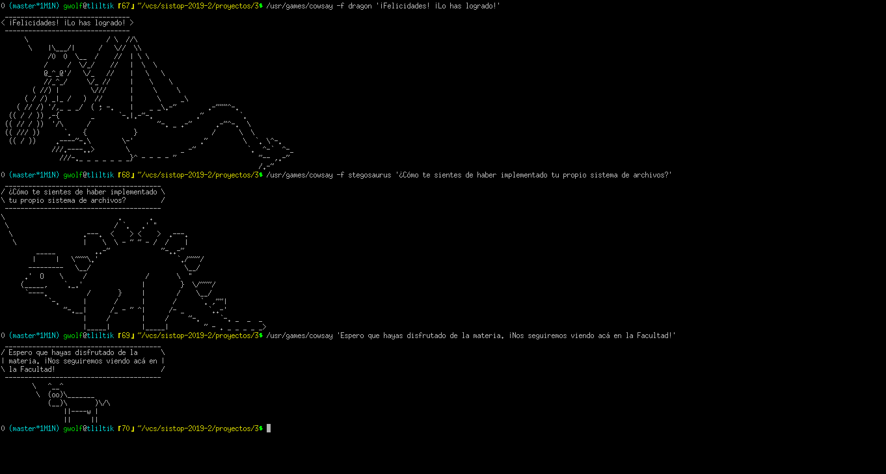
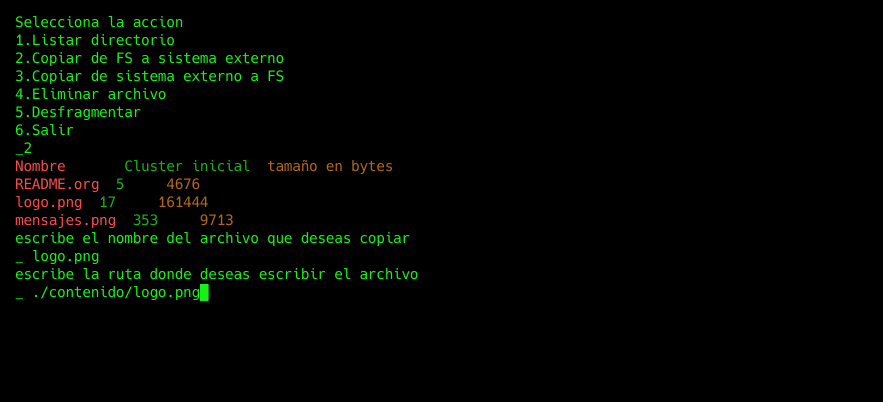
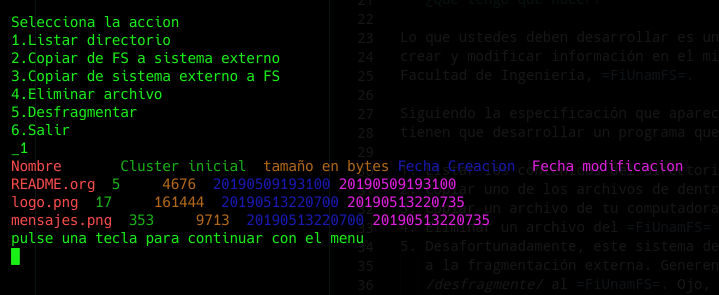
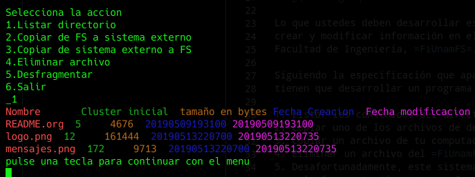

# Micro sistema de archivos FiUNAM
### integrantes
* Vicente Romero Andrade

## Programa
#### Version 0.4
#### lenguaje 
- python 3.*
#### bibliotecas externas
- ninguna

#### uso

```
$ python main.py [-h] -R [ROOT] [-N [NAME_VOL]] [-C]

optional arguments:
  -h, --help            show this help message and exit
  -R [ROOT], --root [ROOT]
                        Define el archivo que contiene o contendra el sistema
                        de archivos
  -N [NAME_VOL], --name-vol [NAME_VOL]
                        Define la etiqueta del volumen
  -C, --create          Define si se creara nuevo sistema de archivos

```

### funciones
* listar contenido
* Copiar del sistema de archivos FiUNAM a sistema externo
* Copiar de sistema externo a sistema de archivos FiUNAM
* Borrar archivo
* Desfragmentar Sistema de archivos FiUNAM

#### Listar contenido
En esta funcion la estrategia que se uso fue la de la lectura
de todos los indices de directorio que tenian como nombre un valor
diferente a ```AQUI_NO_VA_NADA```, se procesa uno por uno cada indice
guardado en un arreglo para su representacion en texto humano.
#### Copiar del sistema de archivos FiUNAM a sistema externo
Se listan los archivos existentes, luego se recibe la cadena con el nombre del archivo y si esta existe dentro del arreglo se recibe el
contenido de cluster inicial y el tamaño que servira para regresar los 
datos crudos, posteriormente se recibe una cadena de destino la cual
puede ser una ruta absoluta o relativa y esta debe contener el nombre
del archivo que puede ser el mismo u otro diferente. El funcionamiento es
analogo al comando ```mv``` solo que este no elimina el archivo origen.
#### Copiar de sistema externo a sistema de archivos FiUNAM
Se recibe la ruta del archivo dentro del sistema de archivos externo,
si esta es valida y corresponde a un archivo se obtendra el nombre del archivo de la ruta
y se mapearan sus datos, luego se calculara el cluster inicial que le corresponderia usando de referencia el cluster final del archivo que esta
mas lejano del princio (cluster 5), se obtiene su tamaño en bytes y se calculara su posible cluster final si este rebasa el maximo posible 1440
se retornara que ya no hay espacio en el sistema de archivos y si no se 
escribiran los datos en el sistema FiUNAM.
#### Borrar archivo
Se listan los archivos existentes, se recibe el nombre del archivo que se 
desea borrar y se elimina su registro del indice de directorio, luego 
se desfragmenta el sistema para una sobreescritura segura y para tener
el maximo espacio disponible para escrituras futuras.
#### Desfragmentar Sistema de archivos FiUNAM
Todos los archivos uno por uno se van recorriendo al principio llenando
los espacios vacios que pueda haber entre clusters, el funcionamiento de 
esto es similar a la escritura solo que aqui es de forma interna, al final
se sincroniza el nuevo indice de directorio.

### Contenido del sistema de archivos muestra fiunamfs.img

- README.org
- logo.png

- mensajes.png


### Capturas de pantalla del sistema funcionando

#### Copia de FS a sistema externo

#### lista de archivos antes de desfragmentacion

#### lista de archivos despues de la desafragmentacion

